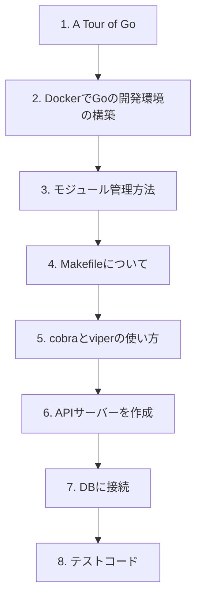

# go-column

## Go言語の学習ロードマップ

```mermaid
graph TD 

A[1. A Tour of Go]
B[2. DockerでGoの開発環境の構築]
C[3. モジュール管理方法]
D[4. Makefileについて]
E[5. cobraとviperの使い方]
F[6. APIサーバーを作成]
G[7. DBに接続]
H[8. テストコード]

A --> B
B --> C
C --> D
D --> E
E --> F
F --> G
G --> H
 

```

